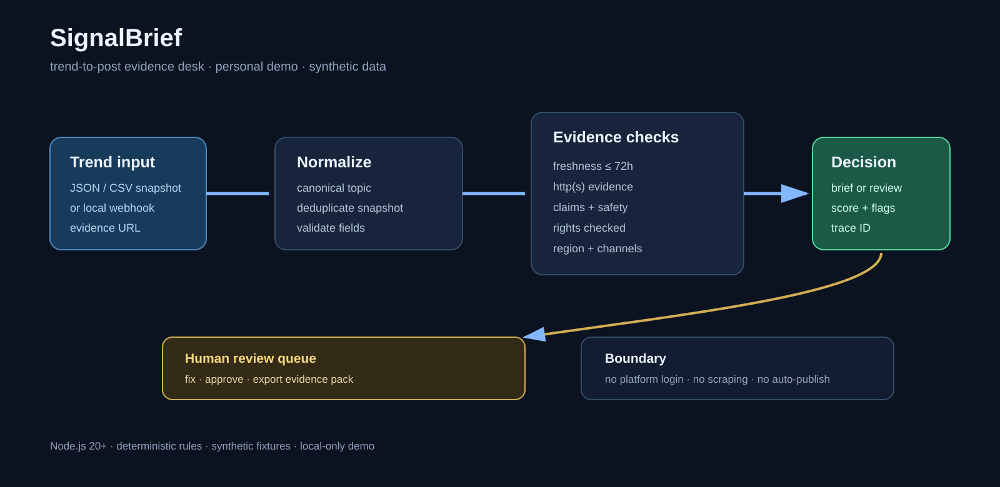

# SignalBrief — Trend-to-Post Evidence Desk

SignalBrief turns a noisy trend snapshot into a small, explainable content brief. It is designed for a social-media operator who wants a safe handoff from research to a human reviewer: every decision has a score, trace ID, evidence URL, and reasons.

> Personal open-source demo · synthetic data · local run · not client work

## Why this exists

Trend tools can make ideas quickly. The harder part is deciding whether an idea is fresh, supported by evidence, safe to use, relevant to the audience, and ready for a person to approve. SignalBrief keeps those checks visible before anything reaches a publishing tool.

## Run it

Requires Node.js 20 or newer and no external packages.

```bash
npm test
npm run audit
npm run brief
npm run benchmark
npm run serve
```

Then open <http://localhost:4173>. The dashboard is intentionally local and read-only with respect to social platforms.

## Pipeline

`ingest → normalize → deduplicate → freshness → evidence → claim/safety → region/channel fit → score → brief → human review`



The sample queue includes a ready item, a stale/claim review, a missing-evidence item, an unchecked-rights item, a replayed duplicate, and an invalid record so the UI shows both the happy path and the boundaries.

## Input and output

The CLI accepts JSON arrays/objects and a small CSV snapshot format. The local server accepts one trend at a time:

```json
{
  "id": "trend-001",
  "topic": "budget-friendly cafe reels",
  "capturedAt": "2026-09-13T10:00:00Z",
  "region": "Bhagalpur",
  "channels": ["instagram", "linkedin"],
  "signalType": "keyword",
  "signalValue": 82,
  "keywords": ["cafe", "reels"],
  "evidenceUrl": "https://example.test/trends/trend-001",
  "draftClaim": "People are asking local cafes for menu details",
  "rightsChecked": true
}
```

```json
{
  "trendId": "trend-001",
  "status": "ready_for_brief",
  "score": 96,
  "flags": [],
  "brief": {
    "angle": "A practical cafe idea for Bhagalpur, grounded in the captured signal.",
    "hooks": ["...", "..."],
    "cta": "Ask for one specific response, then review replies before publishing a follow-up.",
    "channels": ["instagram", "linkedin"]
  },
  "traceId": "..."
}
```

## Local API

| Method | Path | Purpose |
| --- | --- | --- |
| GET | `/health` | local service check |
| GET | `/api/trends` | current decision queue |
| GET | `/api/brief/:id` | one decision and brief |
| POST | `/webhook/trends` | ingest one JSON snapshot; replay is idempotent |

Example:

```bash
curl -X POST http://localhost:4173/webhook/trends -H "content-type: application/json" --data @fixtures/trends.json
```

## Rules that stay visible

- Snapshots older than 72 hours are flagged as stale.
- A duplicate is the same canonical topic, region, channels, and capture time.
- Missing evidence becomes `needs_evidence`.
- Rights uncertainty, guaranteed/viral language, unsupported percentages, and regulated claims become `needs_review`.
- A 0–100 score combines freshness, evidence, audience fit, novelty, and safety.
- A score of 75 or more with no hard flags becomes `ready_for_brief`.

## Evidence pack and visuals

The images in `docs/` are generated from the checked-in fixtures and verified local command output. They are not mock client screens:

| Asset | What it proves |
| --- | --- |
| `dashboard.png` | the local queue, score and human-review detail panel |
| `console-audit.png` | real CLI audit output and trace IDs |
| `evidence-pack.png` | a review-ready JSON/Markdown export |
| `architecture.svg` | the data path and safety boundary |
| `benchmark-run.png` | honest 10,000-record local benchmark output |
| `walkthrough.webm` | short local-run walkthrough sequence |

Every visual carries: **Personal open-source demo · Synthetic data · Local run · Not client work**.

## n8n-compatible shape

`docs/n8n-workflow.json` is an importable starter shape using Webhook → Code → Respond to Webhook. The Code node contains the same rule boundary in a compact form; it does not call a platform or publish anything.

## Safety and limits

This project does not log in, scrape, fetch live trends, store credentials, or auto-publish. Evidence URLs in fixtures point to `example.test`. Before adapting it for a real organization, add authentication, rate limiting, secret management, retention rules, rights review, and an abuse process. See [SECURITY.md](SECURITY.md).

## Roadmap

- Add a reviewer decision history with signed export files.
- Add configurable rule packs for regulated industries.
- Add adapters for official exports only, keeping the local synthetic fixture path as the default.
